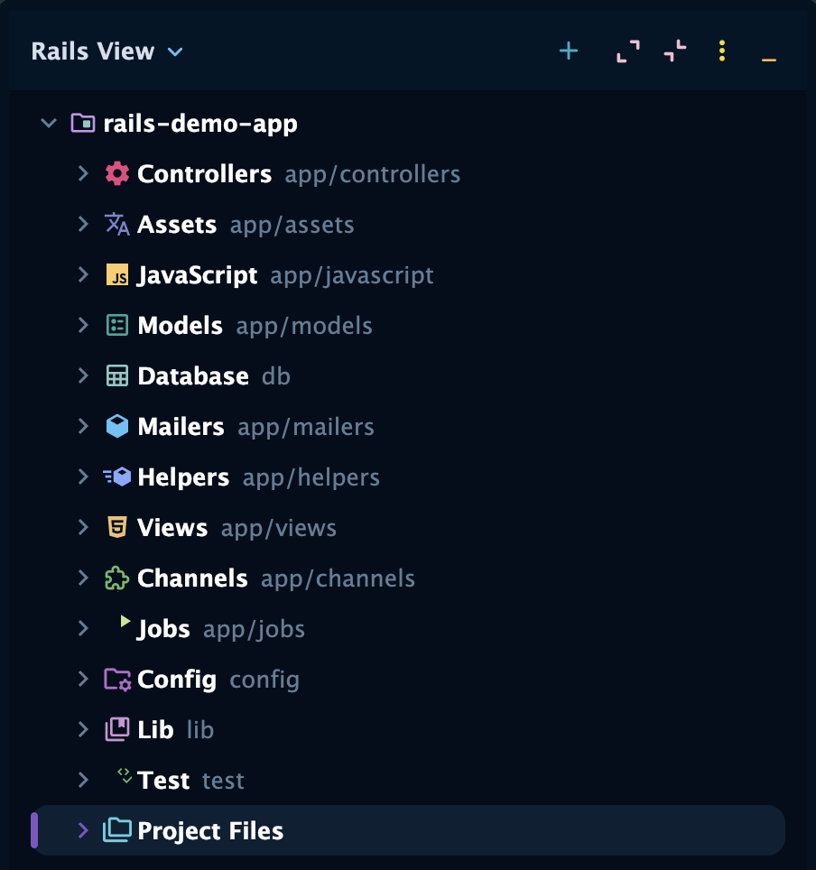

# Rails View — RubyMine Plugin

> **By [Wasabi Elements GmbH](https://susshi.io) · [susshi.io](https://susshi.io)**

The plugin adds a dedicated **Rails View** tab to the Project tool window that organises
your files the way Rails developers think — by function, not by raw directory structure.
Ruby files are shown with their **class names** instead of raw filenames wherever possible.



---

## What you get

```
▼ my-project
  ├── Models          (app/models)
  │   └── User
  │       ├── ▼ Schema
  │       │   ├── id :bigint
  │       │   ├── email :string
  │       │   └── created_at :datetime
  │       ├── ▼ Associations
  │       │   ├── has_many :posts
  │       │   └── belongs_to :organisation
  │       ├── ▼ Scopes
  │       │   └── scope :active
  │       ├── ▼ Attributes
  │       │   ├── attr_accessor :display_name
  │       │   └── ▼ typed_store :settings     ← expanded inline
  │       │       ├── theme :string
  │       │       └── locale :string
  │       ├── ▼ Class Methods
  │       │   └── find_by_token
  │       ├── ▼ Instance Methods
  │       │   └── full_name
  │       └── ▼ Private Methods
  │           └── normalize_email
  │
  ├── Controllers     (app/controllers)
  │   └── PostsController
  │       ├── PostsHelper                    ← matching helper (expandable)
  │       ├── ▼ Partials                     ← _form.html.erb, _card.html.erb …
  │       ├── ▼ Actions
  │       │   ├── index
  │       │   │   └── index.html.erb
  │       │   └── show
  │       │       └── show.html.erb
  │       └── ▼ Private Methods
  │           └── set_post
  │
  ├── Views           (app/views)
  │   └── posts/
  │       ├── index.html.erb
  │       └── show.html.erb
  │
  ├── Services, Helpers, Mailers, Jobs, Channels, GraphQL,
  │   Policies, Serializers, Decorators, Uploaders, Assets,
  │   JavaScript, Config, Lib, Spec, Test …
  │
  ├── Database        (db/)
  │   ├── schema.rb
  │   └── migrate/                           ← sorted newest-first
  │       ├── 2026-03-17-113427 CreatePosts
  │       └── 2026-01-05-090000 CreateUsers
  │
  └── Project Files
      ├── bin/                               ← unclaimed root directories
      ├── Gemfile
      └── …
```

Sections only appear when the corresponding directory exists in the project.
Schema columns, macros, and methods are grouped into folders by default; each group
can be toggled off in **Settings → Tools → Rails View**.

---

## Features

- **Class names** — `.rb` files show their Ruby class/module name (`PostsController`, `User`) instead of the filename (`posts_controller.rb`, `user.rb`). Falls back to a PascalCase conversion when the PSI index is not yet ready.
- **Controller → Views link** — each controller node expands to show a direct shortcut to its matching `app/views/<name>/` directory, including namespaced controllers (`Admin::UsersController` → `app/views/admin/users/`).
- **Migration formatting** — `20260317113427_create_posts.rb` is displayed as `2026-03-17-113427 CreatePosts`, sorted newest-first.
- **Project Files catch-all** — shows curated root files (Gemfile, Rakefile, .env, Dockerfile …) plus any root-level directories not already covered by a dedicated section (e.g. `bin/`, `tmp/`, `log/`, `public/`).
- **Configurable section order** — control which sections appear and in what order via a `.railsview` file (see below).

## Configuring section order

### Per-project: `.railsview`

Create a `.railsview` file in your project root (next to `Gemfile`) to control which
sections appear and in what order. One key per line; `#` starts a comment.

```
# .railsview — Rails View section order for this project
models
controllers
services
views
graphql
database
jobs
mailers
helpers
```

Sections listed in the file appear first in that order. Sections you omit are appended
after in the default order. Sections whose directory doesn't exist are silently skipped.
You can commit `.railsview` to version control so the whole team shares the same layout.

**Available keys:**
`models` · `controllers` · `views` · `helpers` · `mailers` · `jobs` · `services` ·
`channels` · `uploaders` · `policies` · `serializers` · `decorators` · `concerns` ·
`graphql` · `assets` · `javascript` · `config` · `database` · `lib` · `spec` · `test`

## Settings

**Settings → Tools → Rails View**

| Option | Default | Description |
|---|---|---|
| Show test sections | ✓ | Show `spec/` and `test/` in the tree |
| Show Project Files node | ✓ | Show Gemfile, Rakefile, unclaimed directories, etc. |
| Group Views under Controllers | ✓ | Adds a `Views › posts` shortcut under each controller |
| Group methods into folders | ✓ | Organises methods into Class Methods / Instance Methods / Private Methods |
| Group model macros into folders | ✓ | Organises model children into Schema / Associations / Scopes / Attributes |

